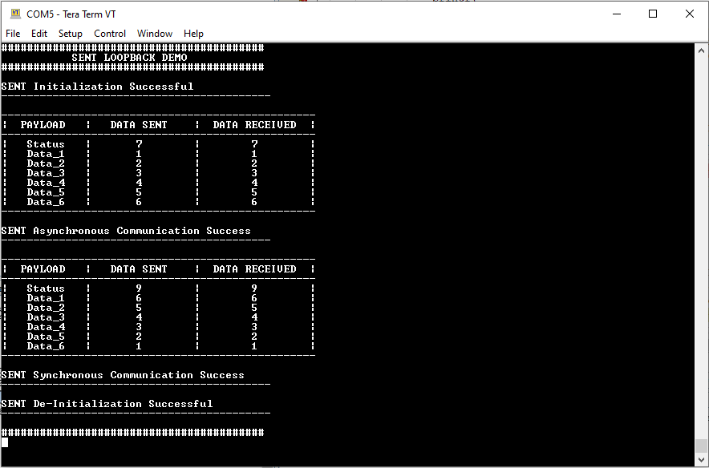
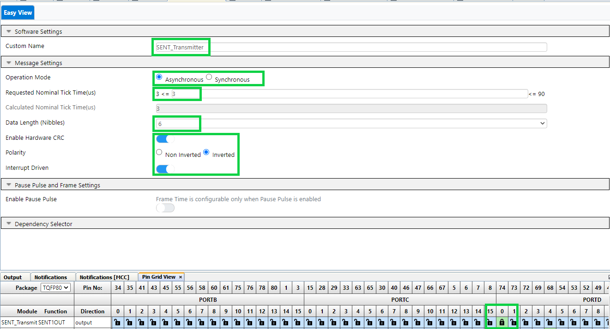
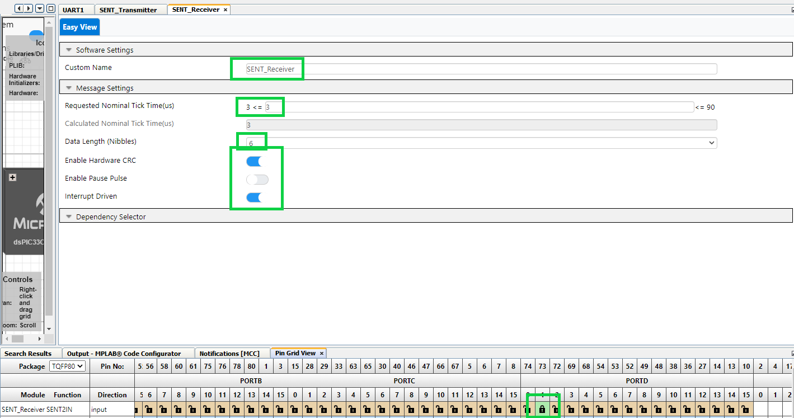

 

## dspic33ck curiosity sent loopback demo

## Summary

The project depicts the usage of SENT module demo with loopback data transfer from two SENT peripherals, where one acts as a transmitter and other as receiver on dsPIC33CK Curiosity Board using MPLAB® Code Configurator.

## Related Documentation

[dsPIC33CK256MP508 datasheet](https://www.microchip.com/dsPIC33CK256MP508) for more information or specifications

## Software Used 

- [MPLAB® X IDE v6.00](https://www.microchip.com/mplabx) or newer
- [MPLAB® XC16 v2.00](https://www.microchip.com/xc16) or newer
- Device Family Pack: dsPIC33CK-MP_DFP v1.8.224
- [MPLAB® Code Configurator (MCC) 5.1.2](https://www.microchip.com/mcc) or newer
- Tera Term or any other serial terminal with the following settings

## Hardware Used

- [dsPIC33CK Curiosity Board](https://www.microchip.com/dm330030)

## Setup

**Hardware Setup**

- Connect a micro-USB cable to port `J7` of Curiosity board to USB port of PC
- Connect a jumper wire from SENT_Tx (RD0) - SENT_Rx (RD1)

**MPLAB® X IDE Setup**

- Open the `dspic33ck-curiosity-sent-loopback-demo.X` project in MPLAB® X IDE
- Build and program the device

**Serial Port Setup**

   

## Operation

- The demo auto triggers two operation modes of SENT - Asynchronous and Synchronous, once the device is programmed.
- The very first state is the Initialization state where the user configurable SENT Payload details are being initialized. User can edit the data inside the function if required.
- In Asynchronous mode operation where the SENT_TX sends the data and SENT_RX peripheral receives the same data. On success the result will be printed on terminal and green LED starts glowing.
- Succeeding the state is the Synchronous mode of operation, which also sends the data from SENT_Transmitter and receives in SENT_Receiver. On success, the result will be printed on terminal and green LED starts glowing.
- Finally the SENT peripherals are reset to POR (Power On Reset) state at the deinitialization.  
- Note that printf() is redirected to UART1 by the compiler for this device   

## MCC Configurations

- SENT TX Configuration :   

- SENT RX Configuration :   

- UART Configuration :   

- Pins Configuration :   
 

